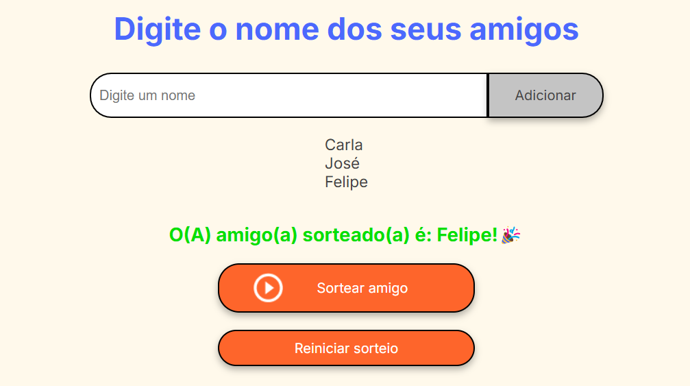

# 🎉 Projeto: Amigo secreto!

 

Este projeto é uma aplicação simples para sortear um "amigo secreto" a partir de uma lista de nomes inseridos pelo usuário.

 

## Funcionalidades
- Adicionar nomes: Permite adicionar nomes à lista através de um campo de entrada e um botão "Adicionar".

- Validação de entrada: Garante que apenas nomes válidos sejam adicionados.

- Exibição da lista: Mostra os nomes inseridos em uma lista visível.

- Impedir que nomes repetidos sejam colocados no sorteio.

- Sorteio aleatório: Sorteia um nome da lista ao clicar no botão "Sortear Amigo" e exibe o resultado na tela.

- Reiniciar para obter um novo sorteio.

## Tecnologias utilizadas

## 📌 Como Usar
  1. Adicionar nomes
  - Digite o nome de um amigo no campo de texto.
  - Clique no botão "Adicionar" para incluí-lo na lista.
  - O nome aparecerá abaixo, na lista de participantes.
    
  2. Validar entrada
  - Se o campo estiver vazio, um alerta será exibido pedindo um nome válido.
  3. Sortear o amigo secreto
  - Após adicionar todos os nomes desejados, clique no botão "Sortear Amigo".
  - O sistema escolherá um nome aleatoriamente e exibirá o resultado na tela.
4. Repetir o sorteio (opcional)
  - Caso queira refazer o sorteio, basta repetir o processo.

## Link do projeto 🤖
[Amigo secreto]( https://leticiahalana.github.io/AmigoSecreto/)

## 📩 Contato

[Link](https://www.linkedin.com/in/leticia-halana-desenvolvedora/) 

## 💻 Desenvolvido por : 

Letícia Halana Ribeiro de Sousa
